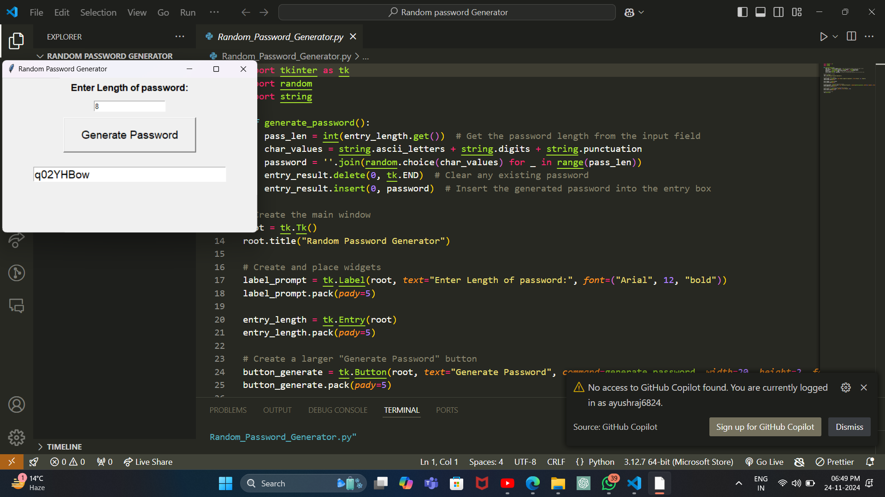

Here is a sample `README.md` file for your GitHub repository. You can copy this and save it in your repository's root folder as `README.md`.

---

# Random Password Generator


## Overview
The **Random Password Generator** is a simple GUI application built using Python and `tkinter`. This tool allows users to generate secure random passwords of customizable lengths using letters, numbers, and special characters.

## Features
- **Customizable Length**: Users can specify the desired length of the password.
- **Random Character Selection**: Includes uppercase, lowercase, digits, and special characters.
- **Easy Copy**: A "Copy to Clipboard" feature for convenience.
- **Error Handling**: Alerts users if invalid inputs are entered.

## How to Use
1. Clone the repository:
    ```bash
    git clone https://github.com/ayushraj6824/Random-Password-Generator.git
    cd Random-Password-Generator
    ```
2. Install Python (if not already installed) from [python.org](https://www.python.org/).
3. Run the application:
    ```bash
    python app.py
    ```
4. Enter the desired password length in the input box.
5. Click on the "Generate Password" button to generate a random password.
6. Copy the password using the "Copy to Clipboard" button if needed.

## Screenshots
### Main Interface


## Prerequisites
- Python 3.x
- `tkinter` (comes pre-installed with Python)

## Future Enhancements
- Add customization options for character types (e.g., include/exclude special characters).
- Save generated passwords to a file securely.
- Add a dark mode feature for the interface.

## Contributing
Contributions are welcome! To contribute:
1. Fork the repository.
2. Create a new branch:
    ```bash
    git checkout -b feature-name
    ```
3. Commit your changes:
    ```bash
    git commit -m "Add feature"
    ```
4. Push to the branch:
    ```bash
    git push origin feature-name
    ```
5. Create a pull request.

## Author
Developed by [Ayush Raj](https://github.com/ayushraj6824).

---
